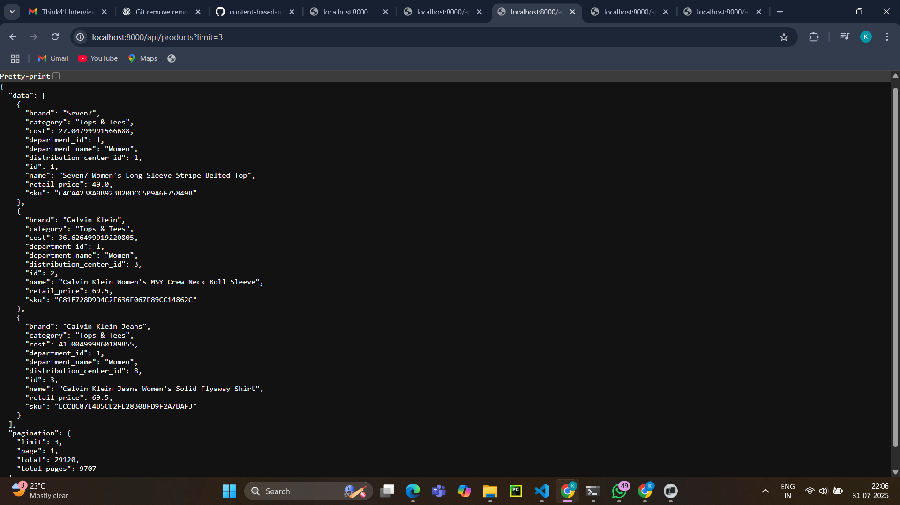
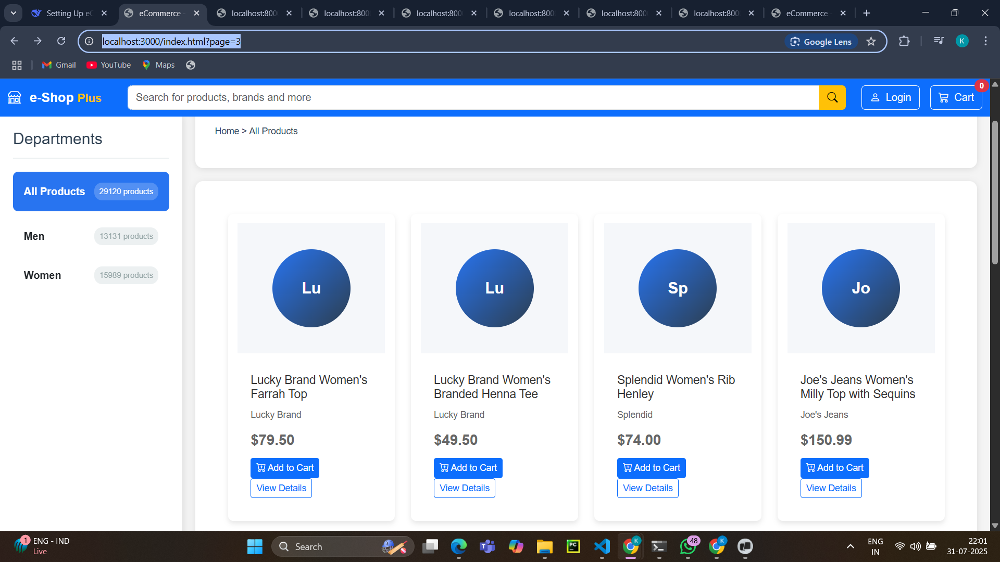

## Backend
The backend is implemented using Flask and SQLite, serving API endpoints for retrieving product and department data. Key files include:

- **`main.py`**: Entry point for the API, registering routes for products and departments.
- **`products.py`**: Handles API requests related to product data, supporting filters, pagination, and searching.
- **`departments.py`**: Handles API requests for department data, such as listing departments and querying associated products.

```bash

{
  "count": 2,
  "departments": [
    {
      "created_at": "2025-07-31 11:42:17",
      "id": 2,
      "name": "Men",
      "product_count": 13131,
      "updated_at": "2025-07-31 11:42:17"
    },
    {
      "created_at": "2025-07-31 11:42:17",
      "id": 1,
      "name": "Women",
      "product_count": 15989,
      "updated_at": "2025-07-31 11:42:17"
    }
  ]
}
```



## Frontend
The frontend consists of HTML/CSS/JavaScript files using Bootstrap for styling. Key functionalities include:

- **`index.html`**: Home page displaying products and department navigation.
- **`script.js`**: Contains client-side logic for interacting with the API, managing the cart, and updating the UI.




## Database
SQL scripts and Python scripts in the `/src/databases/` handle database setup and verification:

- **`04_create_departments.sql`**: SQL script to create and populate the departments table and modify the products table.
- **`setup_db.py`**: Sets up the database by creating tables and loading initial data from CSV files.

## Usage
1. **Setup Database**: Run `setup_db.py` to initialize and populate the SQLite database.
2. **Start Backend**: Run `main.py` to start the Flask server.
3. **Visit Frontend**: Open `index.html` in a web browser to access the application.


# Overview
This is a fictitious eCommerce clothing site dataset. 

## Data Dictionary

### 1. `distribution_centers.csv`
**Columns:**
- `id`: Unique identifier for each distribution center.
- `name`: Name of the distribution center.
- `latitude`: Latitude coordinate of the distribution center.
- `longitude`: Longitude coordinate of the distribution center.

### 2. `inventory_items.csv`
**Columns:**
- `id`: Unique identifier for each inventory item.
- `product_id`: Identifier for the associated product.
- `created_at`: Timestamp indicating when the inventory item was created.
- `sold_at`: Timestamp indicating when the item was sold.
- `cost`: Cost of the inventory item.
- `product_category`: Category of the associated product.
- `product_name`: Name of the associated product.
- `product_brand`: Brand of the associated product.
- `product_retail_price`: Retail price of the associated product.
- `product_department`: Department to which the product belongs.
- `product_sku`: Stock Keeping Unit (SKU) of the product.
- `product_distribution_center_id`: Identifier for the distribution center associated with the product.

### 3. `order_items.csv`
**Columns:**
- `id`: Unique identifier for each order item.
- `order_id`: Identifier for the associated order.
- `user_id`: Identifier for the user who placed the order.
- `product_id`: Identifier for the associated product.
- `inventory_item_id`: Identifier for the associated inventory item.
- `status`: Status of the order item.
- `created_at`: Timestamp indicating when the order item was created.
- `shipped_at`: Timestamp indicating when the order item was shipped.
- `delivered_at`: Timestamp indicating when the order item was delivered.
- `returned_at`: Timestamp indicating when the order item was returned.

### 4. `orders.csv`
**Columns:**
- `order_id`: Unique identifier for each order.
- `user_id`: Identifier for the user who placed the order.
- `status`: Status of the order.
- `gender`: Gender information of the user.
- `created_at`: Timestamp indicating when the order was created.
- `returned_at`: Timestamp indicating when the order was returned.
- `shipped_at`: Timestamp indicating when the order was shipped.
- `delivered_at`: Timestamp indicating when the order was delivered.
- `num_of_item`: Number of items in the order.

### 5. `products.csv`
**Columns:**
- `id`: Unique identifier for each product.
- `cost`: Cost of the product.
- `category`: Category to which the product belongs.
- `name`: Name of the product.
- `brand`: Brand of the product.
- `retail_price`: Retail price of the product.
- `department`: Department to which the product belongs.
- `sku`: Stock Keeping Unit (SKU) of the product.
- `distribution_center_id`: Identifier for the distribution center associated with the product.

### 6. `users.csv`
**Columns:**
- `id`: Unique identifier for each user.
- `first_name`: First name of the user.
- `last_name`: Last name of the user.
- `email`: Email address of the user.
- `age`: Age of the user.
- `gender`: Gender of the user.
- `state`: State where the user is located.
- `street_address`: Street address of the user.
- `postal_code`: Postal code of the user.
- `city`: City where the user is located.
- `country`: Country where the user is located.
- `latitude`: Latitude coordinate of the user.
- `longitude`: Longitude coordinate of the user.
- `traffic_source`: Source of the traffic leading to the user.
- `created_at`: Timestamp indicating when the user account was created.

---

## How to Run the Project

### Prerequisites
- Python 3.x installed
- All required Python packages (Flask, Flask-CORS, pandas)

### Backend (API Server)
1. Open a terminal/command prompt
2. Navigate to the project root directory
3. Run the backend server:
   ```bash
   python -m src.apis.main
   ```
4. The backend will start on `http://localhost:8000`

### Frontend (Web Interface)
1. Open a **new** terminal/command prompt
2. Navigate to the frontend directory:
   ```bash
   cd frontend
   ```
3. Start the frontend server:
   ```bash
   python -m http.server 3000
   ```
4. The frontend will start on `http://localhost:3000`

## Access Links

### Frontend Pages
- **Main Page**: [http://localhost:3000](http://localhost:3000)
- **Products Page**: [http://localhost:3000/index.html](http://localhost:3000/index.html)
- **Departments Page**: [http://localhost:3000/departments.html](http://localhost:3000/departments.html)
- **Department Details**: [http://localhost:3000/department.html](http://localhost:3000/department.html)
- **Product Details**: [http://localhost:3000/details.html](http://localhost:3000/details.html)
- **Test Page**: [http://localhost:3000/test.html](http://localhost:3000/test.html)

### Backend API Endpoints
- **API Home**: [http://localhost:8000](http://localhost:8000) - Shows all available endpoints
- **All Products**: [http://localhost:8000/api/products](http://localhost:8000/api/products)
- **Single Product**: [http://localhost:8000/api/products/{id}](http://localhost:8000/api/products/1) (replace {id} with actual product ID)
- **All Departments**: [http://localhost:8000/api/departments](http://localhost:8000/api/departments)
- **Single Department**: [http://localhost:8000/api/departments/{id}](http://localhost:8000/api/departments/1) (replace {id} with actual department ID)
- **Department Products**: [http://localhost:8000/api/departments/{id}/products](http://localhost:8000/api/departments/1/products) (replace {id} with actual department ID)

### Quick Start
1. Start both servers (backend and frontend) as described above
2. Open your web browser
3. Go to [http://localhost:3000](http://localhost:3000) to access the main application
4. Visit [http://localhost:8000](http://localhost:8000) to see the API documentation

**Note**: Make sure both servers are running simultaneously for the frontend to work properly with the backend API.


## License
This project is licensed under the MIT License.
